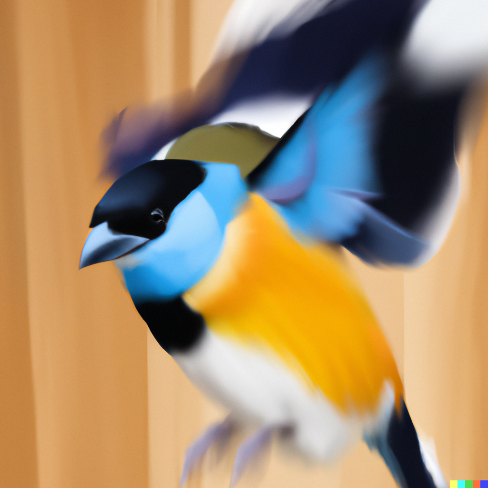

# Flappy-nft
 
Welcome to Flappy NFT's! This is an exciting web app where you can play Flappy Bird and mint your highscore as an NFT on Mantle-Testnet.

This web app is deployed on Vercel, a cloud platform for serverless deployment. You can access the app by clicking on this link: https://flappy-nfts.vercel.app/.

The smart contract is deployed on mantle and can be accessed here: https://explorer.testnet.mantle.xyz/address/0x72A0A69D06738D4692e9D1D1887F96351719faFC and Pinata is used for uploading and pinning metadata.

To run the app yourself, deploy the contract locally after adding your private key to hardhat.config.js: 

`npm install`

`npm install --save-dev hardhat`

`npx hardhat-test`

`npx hardhat run scripts/deploy.js --network mantle-testnet`

